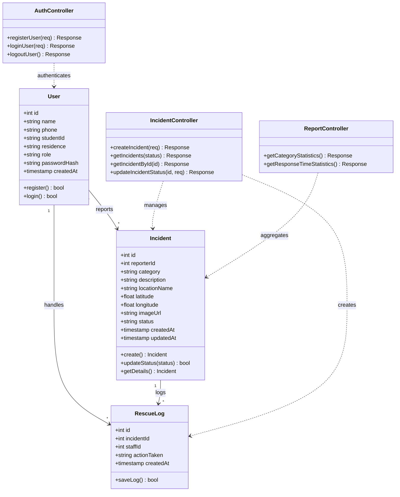

# Class Diagram — CIS Help Me Please

โครงสร้างคลาสและโมดูลการทำงานภายในระบบเว็บแอปพลิเคชันแจ้งเหตุฉุกเฉิน

```mermaid
classDiagram
    class User {
        +int id
        +string name
        +string phone
        +string studentId
        +string residence
        +string role
        +string passwordHash
        +timestamp createdAt
        +register() bool
        +login() bool
    }

    class Incident {
        +int id
        +int reporterId
        +string category
        +string description
        +string locationName
        +float latitude
        +float longitude
        +string imageUrl
        +string status
        +timestamp createdAt
        +timestamp updatedAt
        +create() Incident
        +updateStatus(status) bool
        +getDetails() Incident
    }

    class RescueLog {
        +int id
        +int incidentId
        +int staffId
        +string actionTaken
        +timestamp createdAt
        +saveLog() bool
    }

    class AuthController {
        +registerUser(req) Response
        +loginUser(req) Response
        +logoutUser() Response
    }

    class IncidentController {
        +createIncident(req) Response
        +getIncidents(status) Response
        +getIncidentById(id) Response
        +updateIncidentStatus(id, req) Response
    }

    class ReportController {
        +getCategoryStatistics() Response
        +getResponseTimeStatistics() Response
    }

    User "1" --> "*" Incident : reports
    User "1" --> "*" RescueLog : handles
    Incident "1" --> "*" RescueLog : logs
    
    AuthController ..> User : authenticates
    IncidentController ..> Incident : manages
    IncidentController ..> RescueLog : creates
    ReportController ..> Incident : aggregates
```
