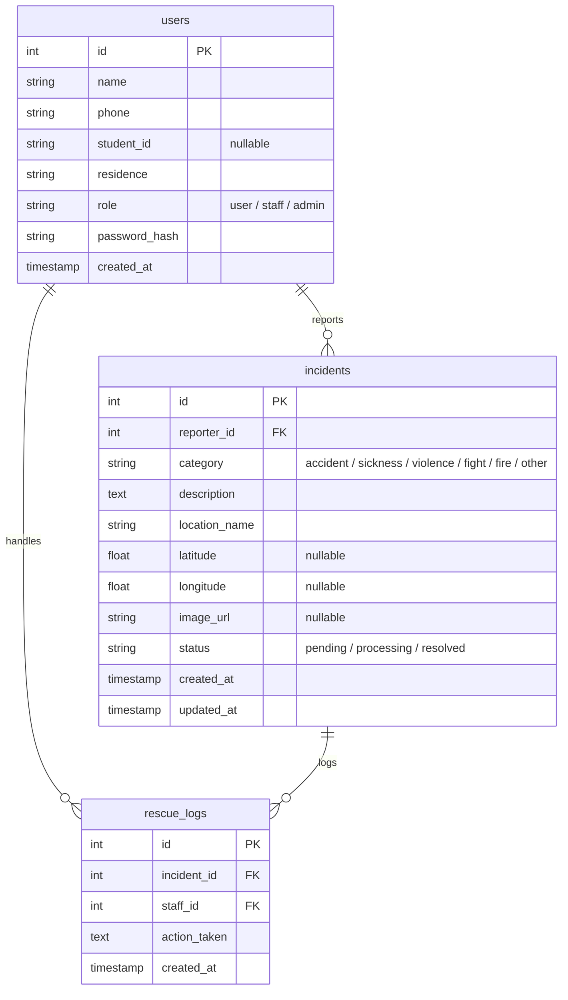

# Database Design — CIS Help Me Please

โครงสร้างฐานข้อมูลสำหรับการจัดเก็บข้อมูลผู้ใช้งาน เหตุฉุกเฉิน และบันทึกการช่วยเหลือ

## Tables

### users
| Column | Type | Constraints | Notes |
|--------|------|-------------|-------|
| id | int | PK, Auto Increment | ไอดีผู้ใช้ |
| name | string | Not Null | ชื่อ-นามสกุล |
| phone | string | Not Null | เบอร์โทรศัพท์ |
| student_id | string | Nullable | รหัสนักศึกษา/บุคลากร |
| residence | string | Not Null | สถานที่พัก/หน่วยงานสังกัด |
| role | string | Not Null, Default: 'user' | บทบาท ('user', 'staff', 'admin') |
| password_hash | string | Not Null | รหัสผ่านเข้ารหัส |
| created_at | timestamp | Not Null, Default: Current Time | วันที่สมัครสมาชิก |

### incidents
| Column | Type | Constraints | Notes |
|--------|------|-------------|-------|
| id | int | PK, Auto Increment | ไอดีเหตุการณ์ |
| reporter_id | int | FK -> users(id), Not Null | ไอดีผู้แจ้งเหตุ |
| category | string | Not Null | ประเภทเหตุการณ์ |
| description | text | Not Null | รายละเอียดเหตุการณ์ |
| location_name | string | Not Null | สถานที่เกิดเหตุ |
| latitude | float | Nullable | พิกัดละติจูด |
| longitude | float | Nullable | พิกัดลองจิจูด |
| image_url | string | Nullable | ลิงก์ภาพแนบ |
| status | string | Not Null, Default: 'pending' | สถานะ ('pending', 'processing', 'resolved') |
| created_at | timestamp | Not Null, Default: Current Time | วันที่แจ้งเหตุ |
| updated_at | timestamp | Not Null, Default: Current Time | วันที่อัปเดตเหตุการณ์ |

### rescue_logs
| Column | Type | Constraints | Notes |
|--------|------|-------------|-------|
| id | int | PK, Auto Increment | ไอดีบันทึกช่วยเหลือ |
| incident_id | int | FK -> incidents(id), Not Null | ไอดีเหตุการณ์ |
| staff_id | int | FK -> users(id), Not Null | ไอดีเจ้าหน้าที่ผู้บันทึก |
| action_taken | text | Not Null | รายละเอียดการดำเนินงานช่วยเหลือ |
| created_at | timestamp | Not Null, Default: Current Time | วันที่บันทึก |
