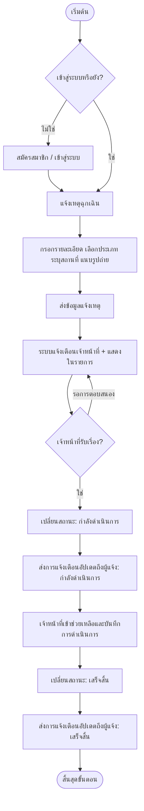
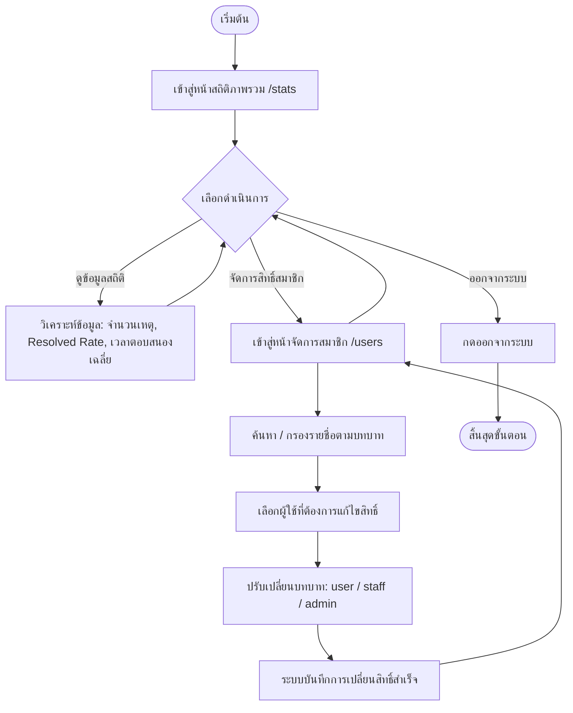

# Flowchart — Emergency Reporting and Rescue Flow

กระบวนการแจ้งเหตุฉุกเฉินและประสานงานเข้าช่วยเหลือภายในมหาวิทยาลัย

---

# Flowchart — Admin Management Flow

กระบวนการตรวจสอบสถิติและจัดการสิทธิ์ของสมาชิกโดยผู้ดูแลระบบ (Admin)

