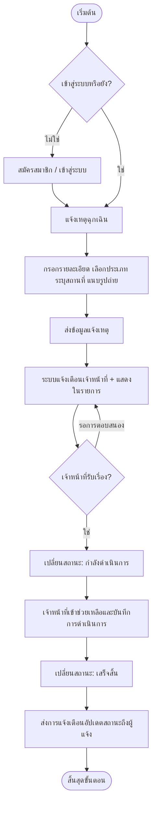

# Flowchart — Emergency Reporting and Rescue Flow

กระบวนการแจ้งเหตุฉุกเฉินและประสานงานเข้าช่วยเหลือภายในมหาวิทยาลัย

```mermaid
flowchart TD
    Start([เริ่มต้น]) --> AuthCheck{เข้าสู่ระบบหรือยัง?}
    AuthCheck -->|ไม่ใช่| Register[สมัครสมาชิก / เข้าสู่ระบบ]
    Register --> Report[แจ้งเหตุฉุกเฉิน]
    AuthCheck -->|ใช่| Report
    
    Report --> InputDetails[กรอกรายละเอียด เลือกประเภท ระบุสถานที่ แนบรูปถ่าย]
    InputDetails --> Submit[ส่งข้อมูลแจ้งเหตุ]
    
    Submit --> NotifyStaff[ระบบแจ้งเตือนเจ้าหน้าที่ + แสดงในรายการ]
    NotifyStaff --> StaffClaim{เจ้าหน้าที่รับเรื่อง?}
    
    StaffClaim -->|รอการตอบสนอง| NotifyStaff
    StaffClaim -->|ใช่| UpdateProcessing[เปลี่ยนสถานะ: กำลังดำเนินการ]
    UpdateProcessing --> PerformRescue[เจ้าหน้าที่เข้าช่วยเหลือและบันทึกการดำเนินการ]
    
    PerformRescue --> FinishRescue[เปลี่ยนสถานะ: เสร็จสิ้น]
    FinishRescue --> NotifyReporter[ส่งการแจ้งเตือนอัปเดตสถานะถึงผู้แจ้ง]
    NotifyReporter --> End([สิ้นสุดขั้นตอน])
```
