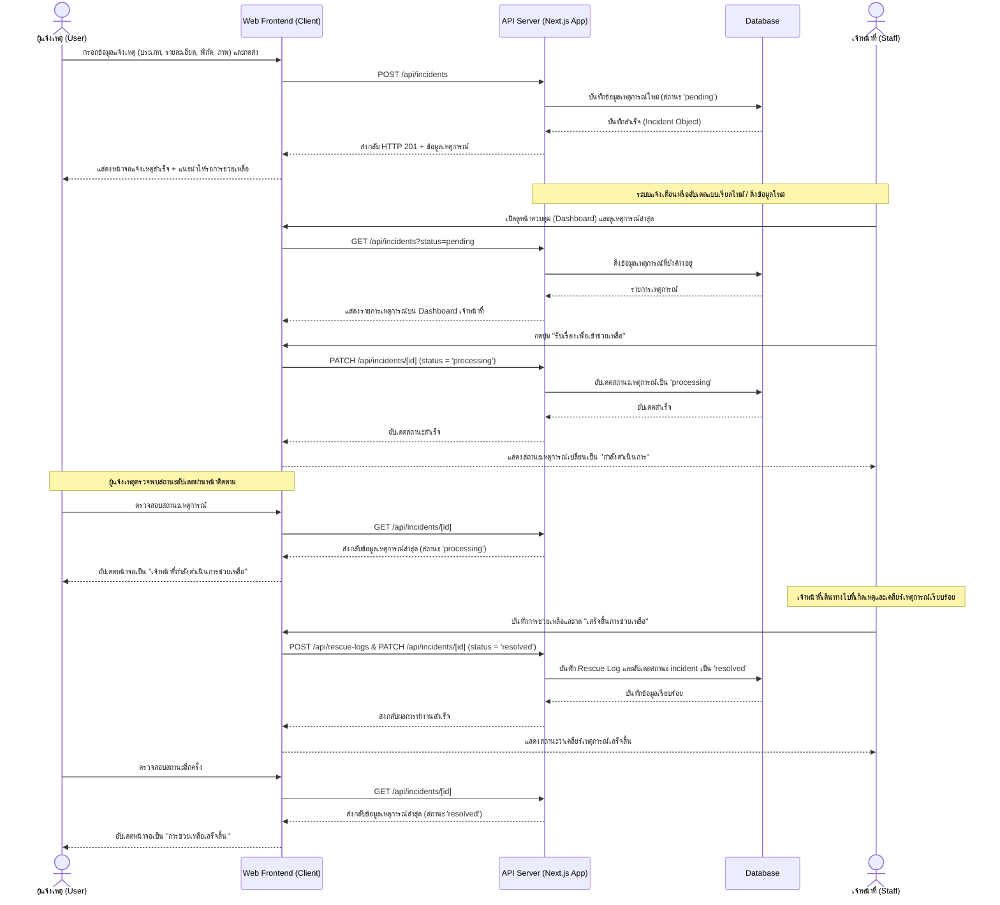
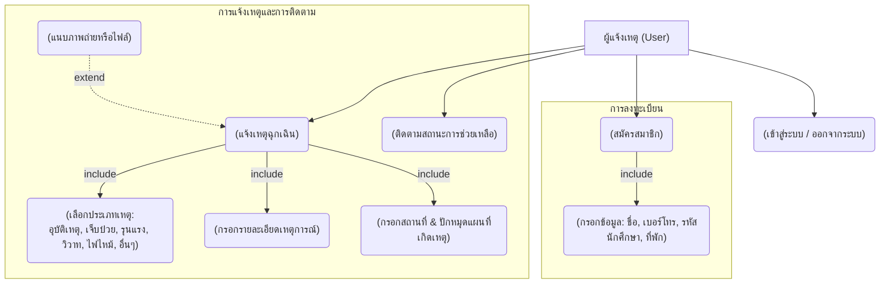
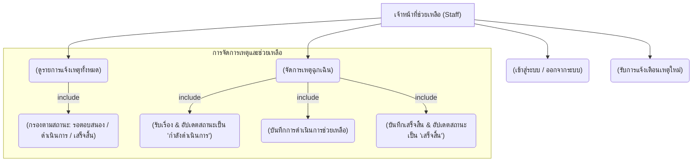
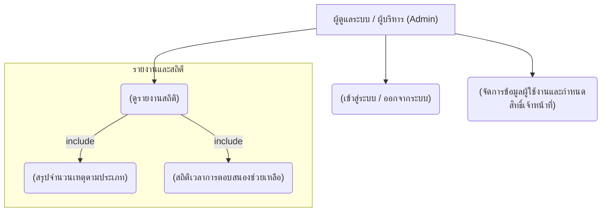

# Sequence Diagram — Emergency Reporting & Resolution Flow

ลำดับการทำงานและปฏิสัมพันธ์ระหว่างผู้ใช้งาน, ระบบเว็บแอปพลิเคชัน และฐานข้อมูล สำหรับกระบวนการแจ้งเหตุฉุกเฉินจนกระทั่งช่วยเหลือเสร็จสิ้น

---

## Use Case Diagram

แผนภาพแสดงบทบาทการใช้งานแยกตาม 3 บทบาทหลัก โดยแสดงรายละเอียดการรับส่งข้อมูลและความสัมพันธ์ของฟังก์ชันต่างๆ อย่างครบถ้วน

### 1. ผู้แจ้งเหตุ (User - นักศึกษา / บุคลากร)

### 2. เจ้าหน้าที่ช่วยเหลือ (Staff)

### 3. ผู้ดูแลระบบ / ผู้บริหาร (Admin)

